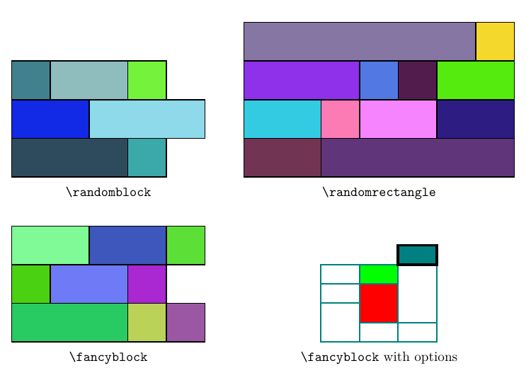

# Fancy Block

With `expl3` and `tikz`.

 - `\fancyblock` receives a 2-dim array to construct blocks. Fill color is random by default (use `random=false` to change it), and you can set the path style by `[<style>]` and set the fill color quickly by `|<color>|`.
 - `\randomblock` receives an 1-dim array to draw random blocks, with the length of every row be the corresponding element of the array.
 - `\randomrectangle` receives two number, which are the width and height of the rectangle that is composed by multiple random blocks.

